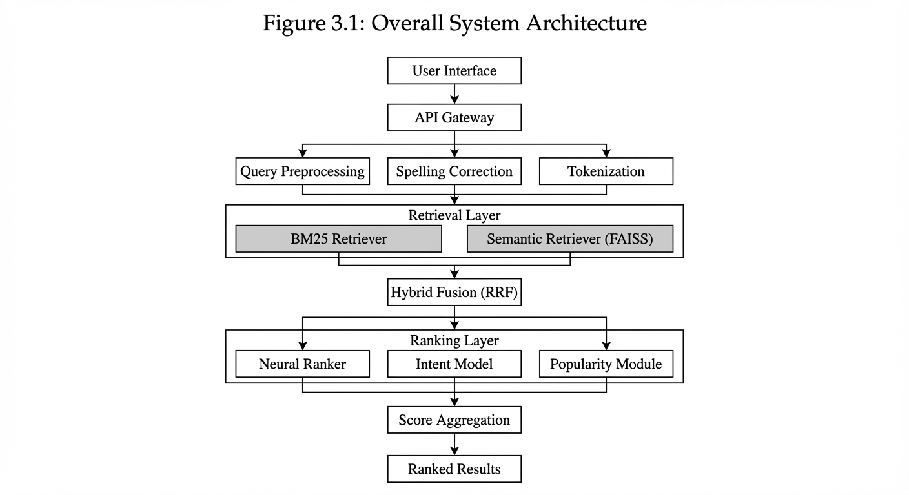
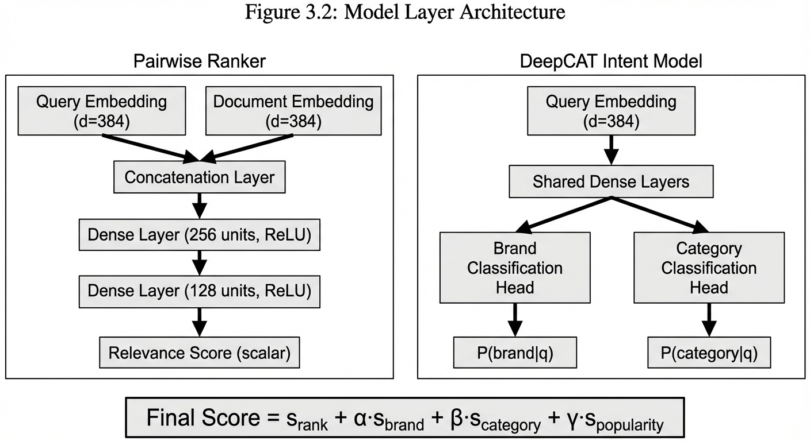
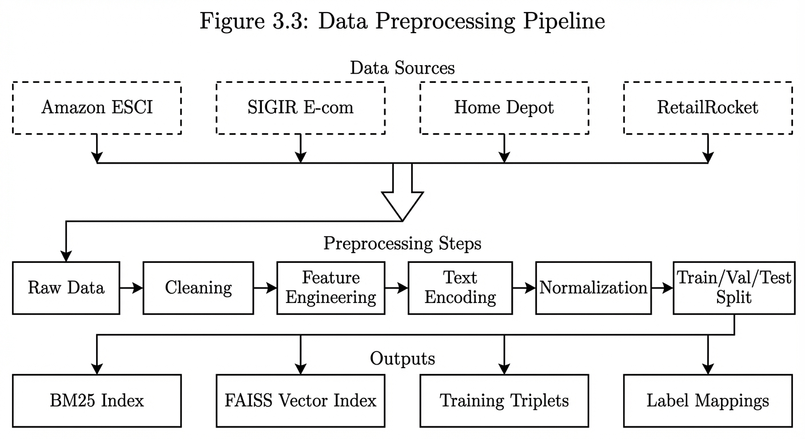
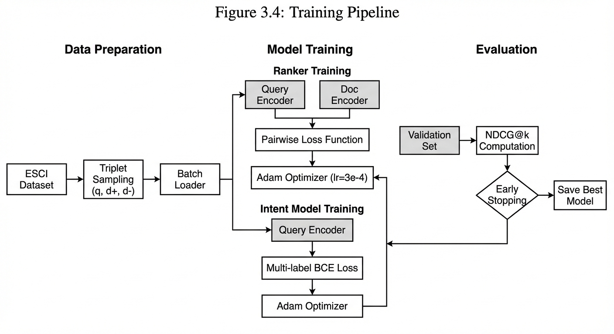
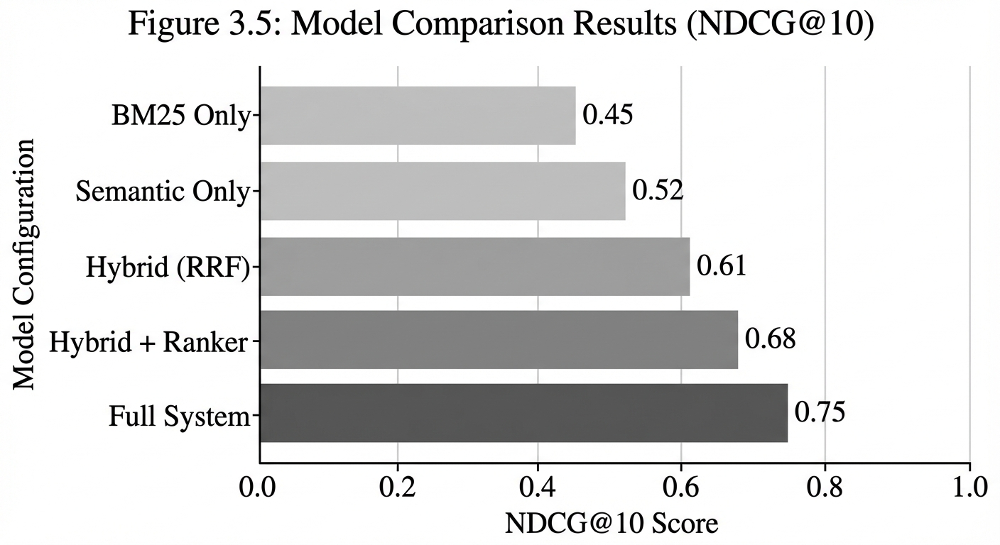
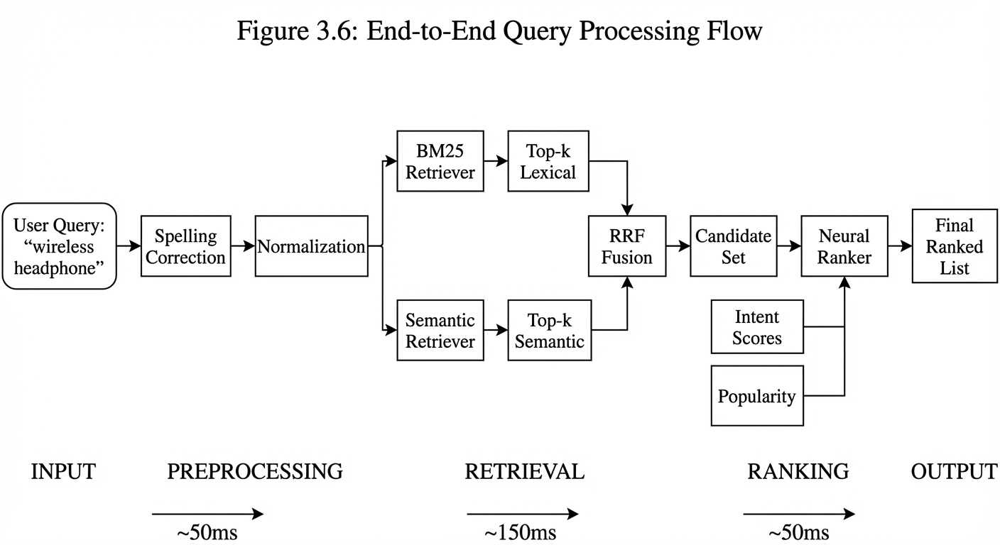
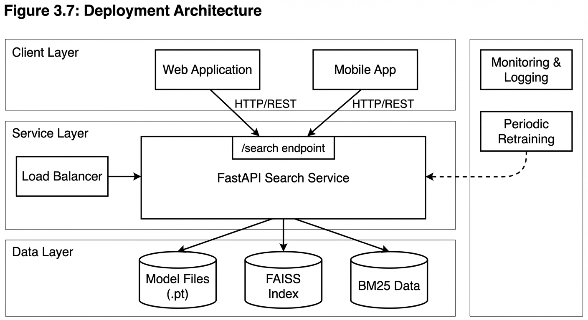

# Chapter 3: System Design & Implementation
## Academic Diagrams for Thesis

These diagrams are designed in academic style suitable for thesis/dissertation submission.

---

### Figure 3.1: Overall System Architecture

Shows the complete system architecture including User Interface, API Gateway, Query Processing, Retrieval Layer (BM25 + Semantic), Ranking Layer, and Output.

---

### Figure 3.2: Model Layer Architecture

Details the Pairwise Ranker neural network and DeepCAT Intent Model architecture with embedding dimensions and output heads.

---

### Figure 3.3: Data Preprocessing Pipeline

Illustrates data flow from 4 sources (ESCI, SIGIR, Home Depot, RetailRocket) through preprocessing to output indices.

---

### Figure 3.4: Training Pipeline

Shows the training process for Ranker and Intent models including loss functions, optimizers, and evaluation metrics.

---

### Figure 3.5: Model Comparison Results

Bar chart comparing NDCG@10 scores across 5 model configurations from BM25 baseline to full system.

---

### Figure 3.6: End-to-End Query Processing Flow

Horizontal flowchart showing query journey from user input through preprocessing, retrieval, ranking to final results.

---

### Figure 3.7: Deployment Architecture

Three-tier deployment architecture showing Client Layer, Service Layer (FastAPI), and Data Layer.

---

## Usage Notes

- All figures use white background with black/gray elements
- Suitable for IEEE, ACM, or standard thesis format
- Recommended to save as PDF for best print quality
